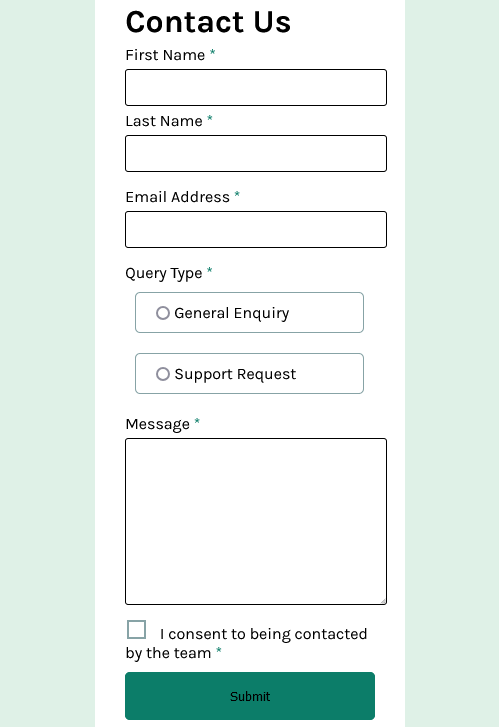

# Frontend Mentor - Contact form solution

This is a solution to the [Contact form challenge on Frontend Mentor](https://www.frontendmentor.io/challenges/contact-form--G-hYlqKJj). Frontend Mentor challenges help you improve your coding skills by building realistic projects. 

## Table of contents

- [Overview](#overview)
  - [The challenge](#the-challenge)
  - [Screenshot](#screenshot)
  - [Links](#links)
- [My process](#my-process)
  - [Built with](#built-with)
  - [What I learned](#what-i-learned)
  - [Continued development](#continued-development)
  - [Useful resources](#useful-resources)
- [Author](#author)
- [Acknowledgments](#acknowledgments)

**Note: Delete this note and update the table of contents based on what sections you keep.**

## Overview

### The challenge

Users should be able to:

- Complete the form and see a success toast message upon successful submission
- Receive form validation messages if:
  - A required field has been missed
  - The email address is not formatted correctly
- Complete the form only using their keyboard
- Have inputs, error messages, and the success message announced on their screen reader
- View the optimal layout for the interface depending on their device's screen size
- See hover and focus states for all interactive elements on the page

### Screenshot




### Links

- Solution URL: [GitHub Repo](https://github.com/stateman24/contact-form.git)
- Live Site URL: [Add live site URL here](https://your-live-site-url.com)

## My process

### Built with

- Semantic HTML5 markup
- CSS custom properties
- Flexbox
- CSS Grid
- Mobile-first workflow
- Vanila JS

### What I learned

I learnt how to use the `:after` and `:before` psuedo selector 
```css
.custom-checkbox::after{
  content: '';
  position: absolute;
  display: none;
  left: 50%;
  top: 50%;
  transform: translate(-50%, -50%);
  background: url("assets/images/icon-checkbox-check.svg") no-repeat center center;
  width: 20px;
  height: 20px;
}
```
I was able so solidfy my understanding on the use of Javascript to change and manipulate element style at certain conditions
```js
const createMessage = (element) => {
  element.style.border = "1px solid red";
  let elementNextSibling = element.nextElementSibling;
  elementNextSibling.style.display = "block";
}
```


## Author

- Website - [Daniel Ajibewa](https://www.your-site.com)
- Frontend Mentor - [@stateman24](https://www.frontendmentor.io/profile/yourusername)
- Twitter - [@ajbewa_daniel](https://www.twitter.com/yourusername)

